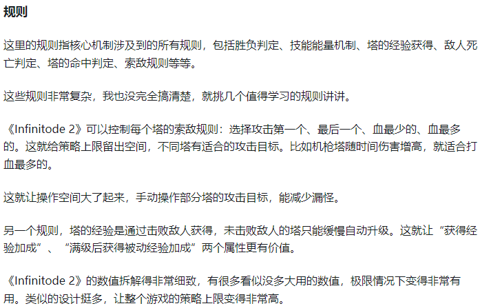
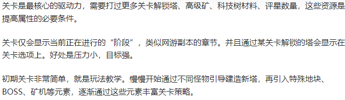

## 1.笔记
### 资料

1. https://zhuanlan.zhihu.com/p/573314348
2. [防御阵型觉醒](https://www.3dmgame.com/gl/15971.html)

### 设计
#### 1.镶嵌系统
1. 燃烧(物理)
2. 毒素(魔法)
3. 雷电(物理, 弹射3个目标(20%攻击力))
4. 特效(3圈)

#### 2.护盾系统
##### 物理护盾
##### 魔法护盾

#### 3.成长系统

#### 4.攻击模式
1. 持续攻击第一个敌人(默认), 一直攻击一个目标不切换, 知道失去目标
2. 攻击最近的敌人, 有更近的目标时主动切换
3. 攻击血量最低(绝对)的敌人, 有更低血量目标时主动切换
4. 攻击血量最低(百分比)的敌人, 有更低血量目标时主动切换

#### 5.无尽模式
##### 通过全部关卡后才解锁无尽模式, 每个关卡可以防守无线波

#### 6.塔
1. 攻速塔(搭配:三环)                -->顶级:攻速上限
2. 伤害塔(搭配:后期三环)            -->顶级:首次攻击目标增加伤害
3. 减速塔                          -->顶级:20概率眩晕1秒
4. 巨额伤害塔(搭配:收集者, 弹射)     -->顶级:伤害上限, 收集者
5. 激光塔()-->                     -->顶级:持续攻击一个目标, 伤害递增
6. 破盾(物理)
7. 破盾(魔法)
8. 破盾(物理+魔法)