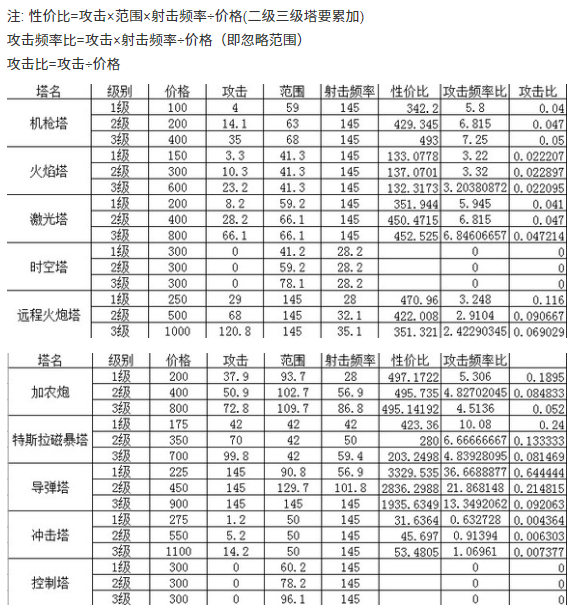

## 1.笔记
### 资料

1. https://zhuanlan.zhihu.com/p/573314348
2. [防御阵型觉醒](https://www.3dmgame.com/gl/15971.html)
3. [防御阵型觉醒贴吧分析](https://tieba.baidu.com/p/1742905703)

### 设计
#### 1.镶嵌系统
1. 燃烧(物理)
2. 毒素(魔法)
3. 雷电(物理, 弹射3个目标(20%攻击力))
4. 特效(3圈)

#### 2.护盾系统
##### 物理护盾
##### 魔法护盾

#### 3.成长系统

#### 4.攻击模式
1. 持续攻击第一个敌人(默认), 一直攻击一个目标不切换, 知道失去目标
2. 攻击最近的敌人, 有更近的目标时主动切换
3. 攻击血量最低(绝对)的敌人, 有更低血量目标时主动切换
4. 攻击血量最低(百分比)的敌人, 有更低血量目标时主动切换

#### 5.无尽模式
##### 通过全部关卡后才解锁无尽模式, 每个关卡可以防守无线波

#### 6.塔
1. 攻速塔(搭配:三环)                -->顶级:攻速上限
2. 伤害塔(搭配:后期三环)            -->顶级:首次攻击目标增加伤害
3. 减速塔                          -->顶级:20概率眩晕1秒
4. 巨额伤害塔(搭配:收集者, 弹射)     -->顶级:伤害上限, 收集者
5. 激光塔()-->                     -->顶级:持续攻击一个目标, 伤害递增
6. 导弹(防控, 升级增加炮弹数量, 一次攻击不同目标)
7. 破盾(物理)
8. 破盾(魔法)
9. 破盾(物理+魔法)

#### 7.路障
##### 放置在路径上面阻挡前进, 可以被破坏, 不会改变前进路线
1. 铁丝网路障
2. 地刺
3. 弹簧陷阱(弹飞, 根据质量计算)

#### 8.怪物
1. 小怪
2. Boss
3. 飞行单位
4. 隐形单位
5. boss技能:3S不受到伤害则回血;闪现;金钟罩;召唤;低血狂暴

#### 9.其它设定
1. 需不需要视野遮挡, 有视野遮挡则需要更多的策略, 但是难度更高, 需要更多的计算。
   或者简化一点儿, 同类型的塔会遮挡，同类型高等级的塔会遮挡低等级的；不同类型的塔不会遮挡
2. 塔越高，射程越远
3. 怪物外置如果比塔的位置+塔高度还高, 则不会攻击
4. 