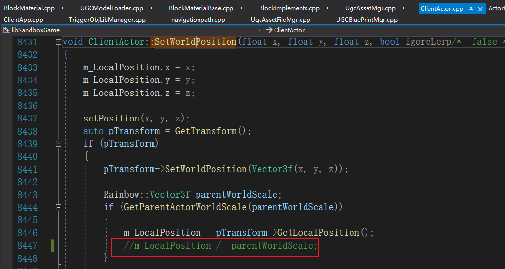

### 1.每日提醒
    1.Ugc分支框架重构, BlockScriptComponent改造、编译报错

### 2.当前版本问题
    1.崩溃
    https://crashsight.qq.com/crash-reporting/crashes/0c2abe1373/6618da0ca8e80cbf169b328fa81fda34?pid=10&crashDataType=unSystemExit
    https://crashsight.qq.com/crash-reporting/crashes/0c2abe1373/9010d9d53893a9763a014b5335d19ca5?pid=10&crashDataType=unSystemExit
    https://crashsight.qq.com/crash-reporting/crashes/0c2abe1373/2b84c5cac224e3f9456552ddec6aaa3b?pid=10&crashDataType=unSystemExit
    https://crashsight.qq.com/crash-reporting/dashboard/0c2abe1373?pid=10&trendVersion=1.45.*&dataType=appendly&topIssueVersion=1.46.*&topIssueDate=20250408&topIssueSortField=DEVICE_COUNT

    2.特效scale问题 https://project.feishu.cn/miniwan/bug/detail/5507794621

### 2.近期计划
    1.场景树分文件存储
    2.场景树多world
    3.C++模型组件成员变量优化(太多了)

### 3.长期计划
    1.高级模式性能分析
    2.方块实用自定义材质, chunk刷新的效率问题

### 4.已完成:
#### 1.2025.3.12
    1. 场景树存储结构方案
    2. 2.0与3.0融合方案
    3. OKR

### 5.周会
    1.当前版本外放需求
    2.下个版本工作安排
    3.BUGFIX 模块交接
    4.绩效

### 6.工作交接
    2025.2.20
    杨佳-->显超: 选择器、节点树、3轴操作
    祺镇-->潘云飞、邹龙进: 笔刷、框选工具，mod打包
    少斌-->王帅:模型组件, 

### 7.Temp
    需要去掉:
https://project.feishu.cn/miniwan/bug/detail/5475902336
