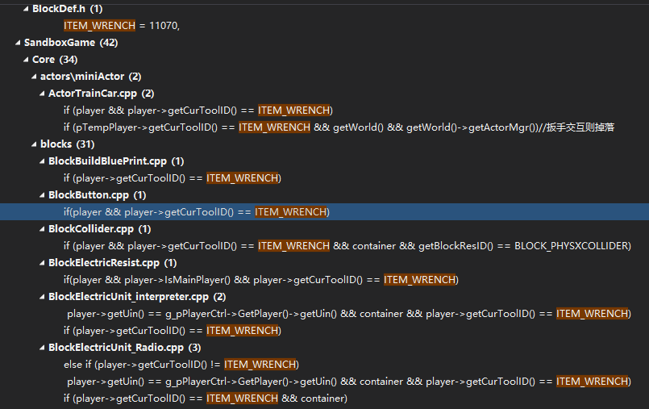
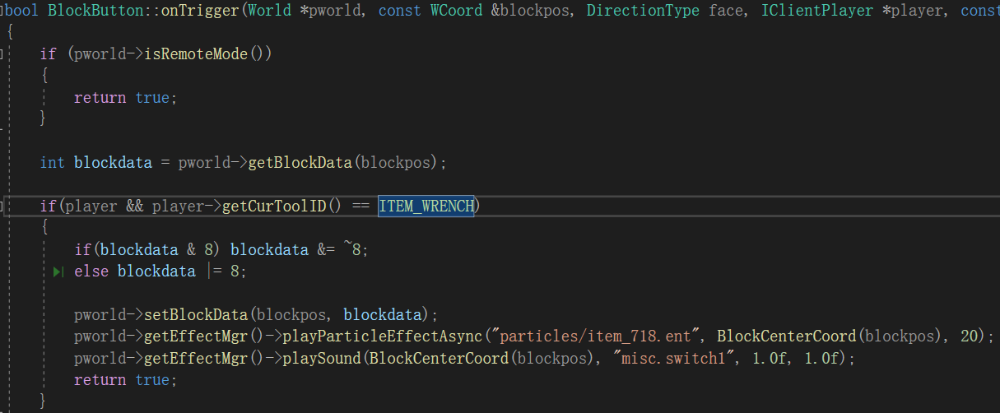
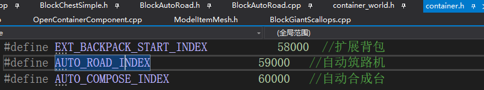
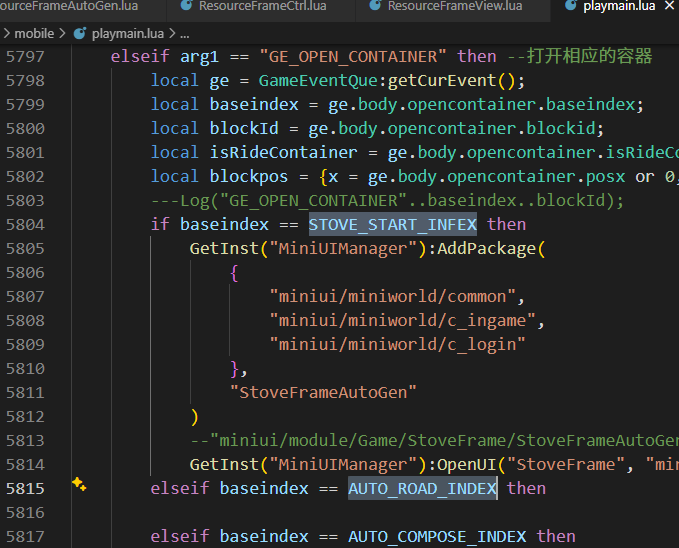
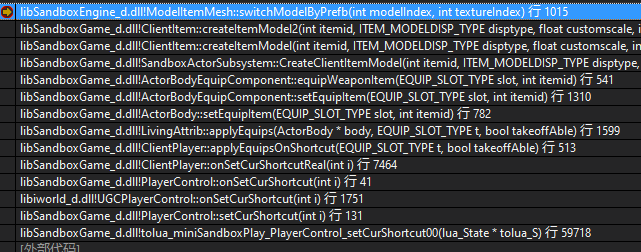
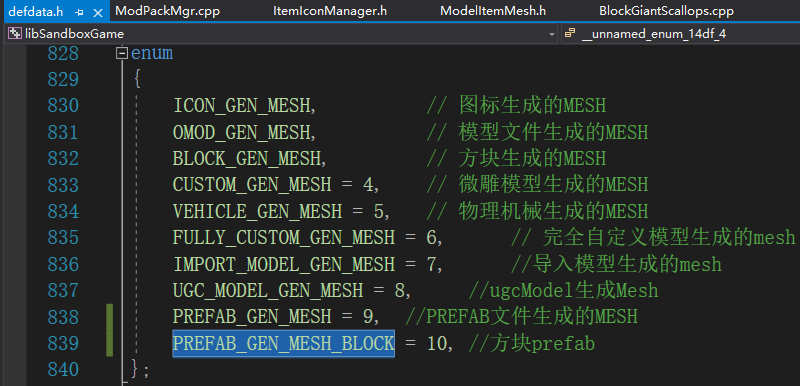
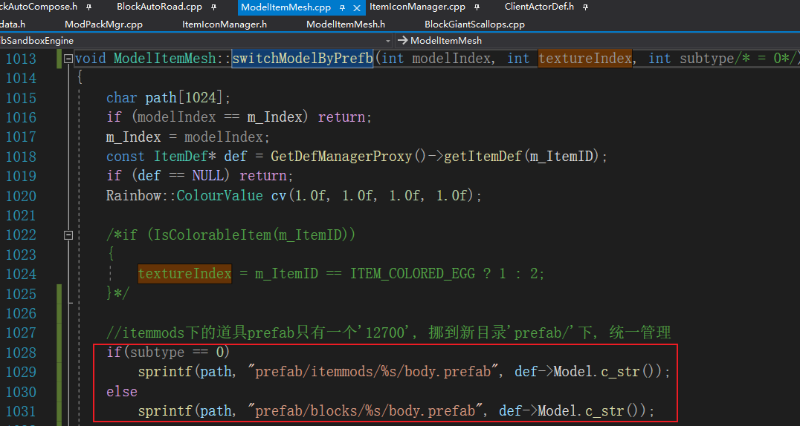

#### 1.方向扳手道具
##### 1.老扳手
    ITEM_WRENCH = 11070,
    在所有交互的地方特殊处理:

    例如:

##### 2.方向扳手

虚空冬温花类使用宏定义的, 直接搜类名或type找不到:
BlockVoidPlants.h

voidModelWinterFlower, BlockVoidModelWinterFlower, 继承"ColorHerbMaterial"

##### 3.通用多个方块基类
    BlockMultiBase
    
##### 4.自动筑路机
    容器index定义

    打开容器, 调用到lua: GE_OPEN_CONTAINER

##### 5.手持模型

    手持prefab模型 ModelItemMesh::switchModelByPrefb
    新增一个方块手持物模型类型 PREFAB_GEN_MESH_BLOCK
    
    区别在这里:
    

    道具图标: ItemIconManager::getItemIconDesc
    
