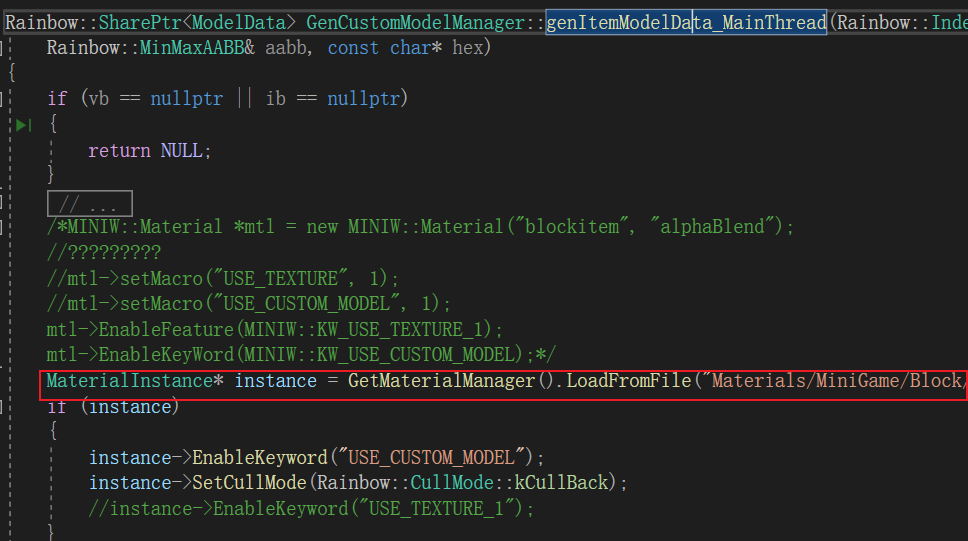
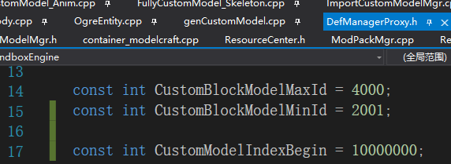
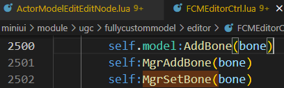

#### 1.原流程
1. 根据方块数据生成mesh
    CustomModel::load
    CustomModel::genGeomTemplate()
    CustomModel::genGeomTemplateInternal
    BlockMaterialMgr::genGeomTemplate

2. Rainbow::Mesh序列化
   参考这里  
     
     

    if (obj->IsKindOf<Asset>())
    {
        Asset* asset = static_cast<Asset*>(obj);
        asset->SetResPath(fullPath.c_str());
        GetMetaLoader().CreateAssetAndMeta(guid, asset);
    }

    UgcAssetMgr::UploadFBXModel(std::string fbxName)

    

    UIActorBodyMgr::getUgcTempModelBody

3. 渲染
   shader像素着色器来这里:

   

   ProcessToonShadingFS

   

   直接给个绿色:

   

   看了下这个shader没有使用顶点颜色:
   ProcessBasicVS(inout MaterialVertex mv)
   ProcessCharacterVertexData
   顶点色直接被环境光等覆盖了:

   

    微缩的颜色应该是反的:

    

    应该是这样才对:

    

    实体设置成红色是这样的

    

    自定义模型在UI上显示: UIActorBodyMgr::getCustomModelBody()

    微缩转模型 CustomModel::getItemModel(ITEM_MESH_TYPE meshtype)

    GenCustomModelManager::genItemModel()-->

    GenCustomModelManager::genItemModelData_MainThread

    终于看见微缩的材质了:"Materials/MiniGame/Block/block_item_translucent.templatemat"

    

    对应的shader:

4. 上传云资源
   可以在这里看云资源id:

   
   

5. 微缩模型制作
   

   ContainerModelCraft::ProductOne()-->

   CustomModelMgr::addCustomModel()-->

   微缩道具的模型生成:
   

   微缩道具'手‘不显示的问题: 这个手是个特效, 离角色距离过远会不显示: EffectManager::tick()
   
   
   这里调大就会显示, 跟可视距离还不是一回事.

   手持微缩道具模型做了偏移:

   

   ActorBodyEquipComponent::equipWeaponItem(EQUIP_SLOT_TYPE slot, int itemid)

   

6. 完全自定义模型
   

[11:57:05 471] UploadFBXModel success:1, id:AssetId://316725993826533382

完全自定义编辑器流程

创建: ActorBody::initExampleFCMActor(std::string skey)

关闭编辑: FullyCustomModelMgr::closeEditModelUI-->

保存: ContainerFullyCustomModel::updateFullyCustomModelData

这里会生成Model, 是不是在这是生成资源包
ContainerFullyCustomModel::updateEntity()

FullyCustomModelMgr::createObjectByCurEditModel

6. 完全自定义模型数据构建ActorBody
ActorBody::initFullyCustomActor

Model::CreateInstanceFromGameObject(GameObject* go)

完全自定义模型父子关系

7. 骨骼动画资料
   https://blog.csdn.net/qq_33060405/article/details/139075342

8. 微缩组合
   CustomModelPacking::requestCreatePackingFcm-->

   CustomModelPacking::tick()-->

   CustomModelPacking::createPackingFcm-->

   CreatePackingFcm-->多线程里面

   CustomModelPacking::setFCMByPackingBlockWithLevelAccessor-->

   

   CustomModelPacking::createPackingFcmResultHandle-->多线程生成微缩组合完成, 在这里生成mesh

9. 加载流程
    加载.mf文件, 只加载一次
    CustomModelMgr::preLoadMapCustomModelData-->
    CustomModelMgr::loadCustomModelItem()-->
    

    加载CustomModel文件:
    GameSuviveLoadHandler::hostUpdate()-->

    

    GameSuviveLoadHandler::setLoadProgress()-->

    GameSuviveLoadHandler::loadCustomModelFile-->

    这个接口要改'ResourceCenter::getFolderNameByResType(ResourceDefineType restype)'
    
    

    加载'manifest'
    ResourceCenter::loadMapClassManifest

10. 微缩模型生成预制
    生成:
    ContainerModelCraft::ProductOne()-->
    CustomModelMgr::addCustomModel-->
    CustomModelMgr::getFreeId(int type)-->获取可用的def ID
    GetDefManagerProxy()->addDefByCustomModel-->添加def

    加载:
    GameSuviveLoadHandler::setLoadProgress()-->
    GameSuviveLoadHandler::loadCustomModelFile-->
    CustomModelMgr::loadOneMapCustomModelDataImpl-->
    GetDefManagerProxy()->addDefByCustomModel-->添加def

    生成的时候不在生成一个blockid, 换成一个底层的index就可以:
    

    生成blockdef改成生成prefab:
    

    fb中增加一个字段存储:

    

    加载微缩的时候也不生成blockdef了, 但是要做新老兼容, 根据id判断, 老id是从2000到4000, 新id是>10000000
    CustomModelMgr::loadOneMapCustomModelDataImpl

    

    从工作台取出结果放进背包: CustomModelCtrl:OnCreatedItemClick()

11. 微缩道具
    跟微缩工具太流程基本一致
    生成模型应该是有区别的, 方块的范围是20*20*20, 道具是20*60*60
    道具生成模型:
    GenCustomModelManager::genItemModel-->
    GenCustomModelManager::genItemModelFromPos-->
    GenCustomModelManager::genItemModelData_MainThread-->
    

12. 微缩生物
    CustomModelMgr::createAndSaveActor-->
    CustomModelMgr::saveCustomActor-->

    

    微缩生物实例加载模型(跟完全自定义模型还不一样):ActorBody::initCustomActor

    微缩生物存储在: 存储的是骨骼与微缩的绑定关系

    
    
    

    加载:CustomModelMgr::loadCustomActor(int type, int realowneruin/* =0 */)

    AssetId://321470179972337664

    //UGCGameObject_s_321470179972337664

##### 微缩生物-选部件
    

    这里本来是选择微缩的, 微缩上云了, 这里选择微缩云资源

    ActorModelEditEditNode:OnAvatarClick(selectedIdx, disableAdd)

    选择完模型回调: ActorModelEditEditNode:OnSelectModelReturn(fileName)

    

    新增绑定: CustomModelMgr::bindCustomAvatar

    

    更新绑定: CustomModelMgr::replaceCustomAvatar

    骨骼默认参数配置:

    

#### 完全自定义-选部件
    FCMEditorCtrl:RegisterUIEvents()-->

    self:NewBtnClicked()-->

    选择模型 NewFrameSelectModelBtnClicked-->

    新增部件-->

    

    FullyCustomModelMgr:addCustomBone(bone.name, bone.parentName, bone.modelID);

    FullyCustomModelMgr:setCustomBone(bone.name, bone.scale, bone.offsetPos.x, bone.offsetPos.y, bone.offsetPos.z, bone.rotate.yaw, bone.
    
    rotate.pitch, bone.rotate.roll)
	
    FullyCustomModelMgr:setBindModelOffset(bone.name, bone.subModelPos.x, bone.subModelPos.y, bone.subModelPos.z)
	
    FullyCustomModelMgr:setBindModelRotate(bone.name, bone.subModelRotate.yaw, bone.subModelRotate.pitch, bone.subModelRotate.roll)
	
    FullyCustomModelMgr:setBindModelScale(bone.name, bone.subModelScale)

#### 完全自定义-打开编辑初始化
    FullyCustomModelMgr::getCurEditActorBody-->

    ActorBody::initFullyCustomActor-->

    FullyCustomModel::setModelData-->

    FullyCustomModel::ApplyModelData-->

    FullyCustomBoneData::loadModelAsync-->

#### 强制只有CM模型走静态, 其它走动态

obj和fbx调好后这里可以去掉

