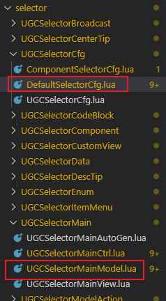
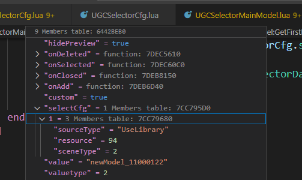
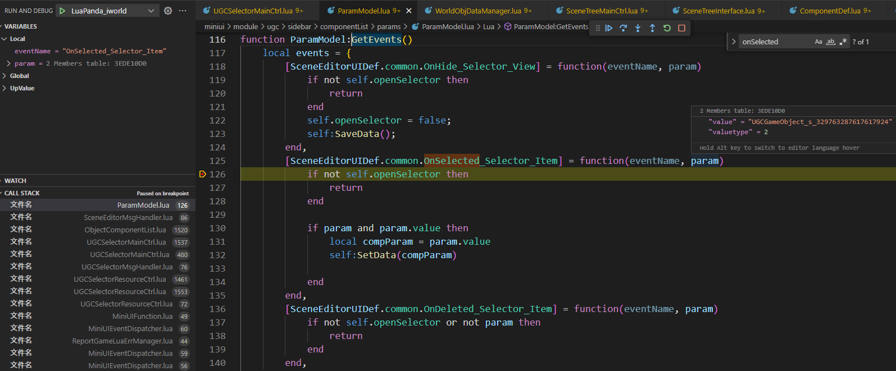
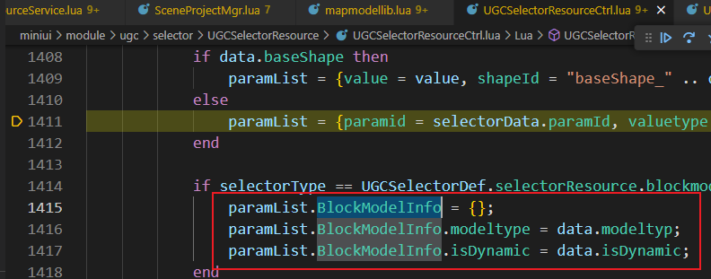
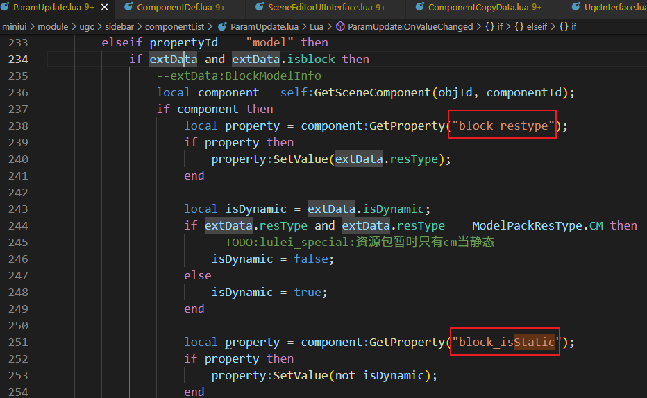
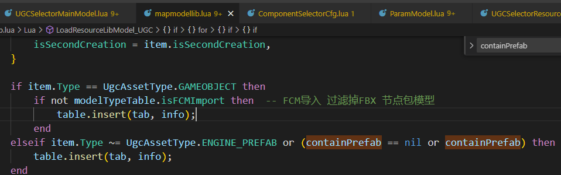
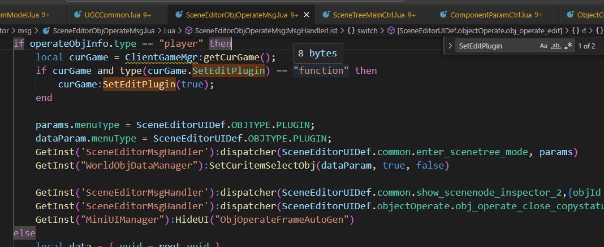

#### 1.选择器

##### 1.配置 DefaultSelectorCfg.lua

##### 2.方块模型选择器过滤静态、动态模型

选择模型后回调:UGCSelectorResourceCtrl:OnItemClickEvent(item, inData)-->

增加方块模型信息:

最后在这里特殊处理一下, 设置模型的时候同步设置一下模型类型和是否静态的标志
ParamUpdate:OnValueChanged(data)

##### 3.过滤标记直接复用"containPrefab"即可
mapmodellib.lua-->
LoadResourceLibModel_UGC-->

##### 4.角色预制编辑场景

##### 5.插件进入编辑场景
CheckEditItemComponent