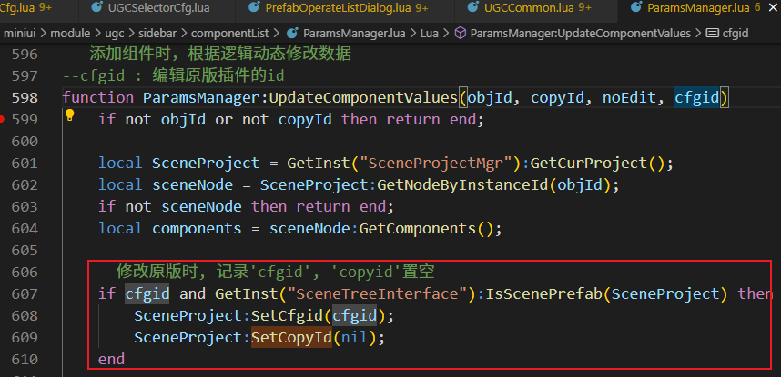
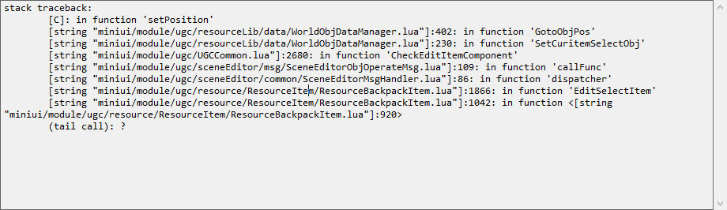

#### 1.方块预制编辑
原版插件另存为模板: SceneProjectMgr:CreatePrefabFromNode(node, dir)

#### 2.生物预制
生物有点儿特殊, 没有"MonsterEdit"组件, 且修改原版插件时copyid为0:

最新的生物已经去掉'MonsterEdit'了:

编辑原版插件:
UGCCommon:CheckEditItemComponent-->
UGCCommon:CheckNewItemComponent

修改原版的记录一下'cfgid'(一定有), 并把'copyid'置空:

#### 2.角色预制编辑

#### 3.预制编辑场景

#### 4.预制场景围绕对象旋转视角

##### 1. PrefabEditModeMgr.cpp
进预制编辑场景的时候把摄像机挂给了实例
CameraManager::SetCameraMountObj
SceneTreeInterface:AttachToPrefabScene(objID)
SceneTreeInterface:CreateGameObjectFromSceneNode
UGCCommon:CheckEditItemComponent
UGCCommon:SetPrefabEditCameraOffset(objid)
CameraMgr:SetCameraMountObj(objid, true);

##### 2. 摄像机围绕目标旋转
PrefabEditModeMgr::RotateAroundActor

#### 5.高级编辑模式
##### 1.移动的区别
ActorLocoMotion::MoveStep-->
PlayerLocoMotion::doMoveStepV2(WCoord &wc_motion)

void PlayerLocoMotion::addRealMove(const CollideAABB &box, WCoord &realmov)
设置物理速度: m_PhysActor->SetLinearVelocity(motion * 3.2f * MOTION2VELOCITY);

#### 6. 熔炼和配方插件没有显示模型(预制编辑场景)

GameObject:CreateEditActor
需要加个'model'组件?

#### 7.预制编辑场景直接杀进程退出, 重进游戏player位置没恢复
进入编辑场景这里设置了玩家位置, 没有按正常返回流程退出场景, 位置没恢复:

#### 8.C++显示lua堆栈
const char* statck = lua_get_traceback(MINIW::ScriptVM::game()->getLuaState());

#### 9.方块模型染色无效
方块是'blockmesh'不是model:

方块材质'BlockMesh'新增Color设置接口:

#### 10.开启、关闭滤镜效果
int lut = gameCfgMgr->GetLutFilter();
GetSandboxRenderSetting().SetLUTEnable(lut > 0);

UGCEnvironmentMgr::SetPostProcessEnable(bool b)-->

#### 11.shader报错回来这里

#### 11.渲染、截图问题

这回导致在预制编辑场景渲染是走老的材质, 外面走的npr材质, 效果上会有各种差异, 如:

但是直接去掉截图会有问题, 预制截图流程:
SceneEditorMainframeView:QuitSceneTreeMode
ScenePrefab:SnapShot()
SceneTreeInterface:SnapShotActors(actorId, path)
UgcAssetMgr::SnapShotActors

老材质更黑, 这里有个阴影系数是0.55导致:

LegacyCharacterPS->
GetColoredBlockShadow->
ModifyShadow->gShadowParameters

