#### 1.模型组件改造
##### 1.选择模型流程
模型加载完成, 加载初始材质列表 ModelComponent::UpdateModelAttrWhenChangeModel()

默认材质的参数其实都是默认值:
ModelComponent::InitModelMaterial()-->
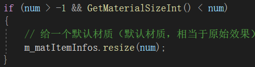

然后通知lua刷新材质列表：
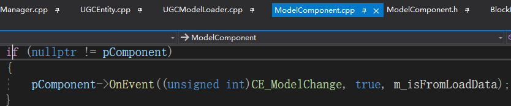
ParamModel:BindModelChangeEvent(isUpdateUI)
ParamModel:AfterModelChanged(modelInst, isUpdateUI)

方块模型组件材质参数部分隐藏规则:
ParamMaterialGroup:RefreshCustomDef()
ParamModel:IsSingleMatAttr()

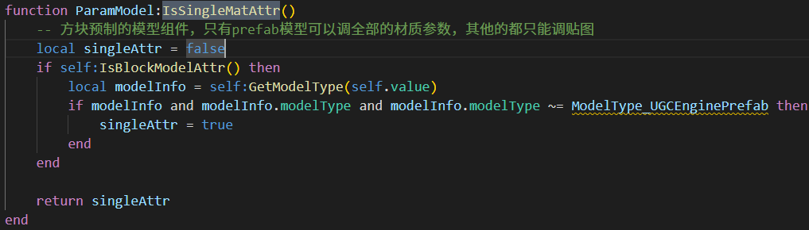

材质选择如果选择自定义图片的话, 这里要配置一下:

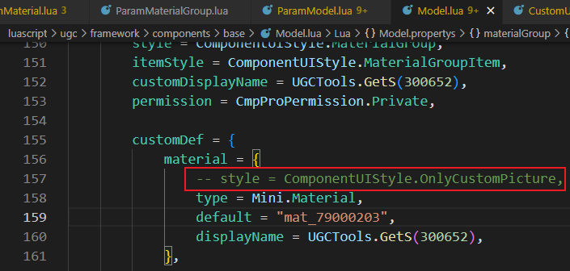

##### 2.原生方块材质组配置
ORIGIN_BLOCK_MATERIAL_CFG
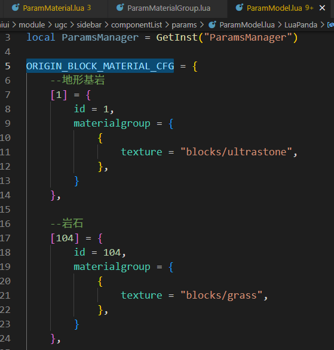

#### 2.原生方块支持材质
##### 1.basic方块
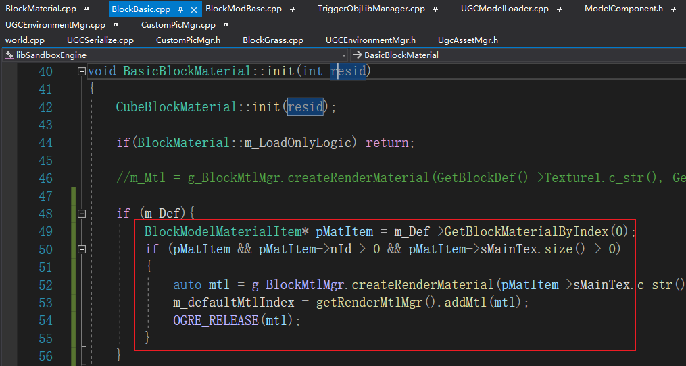

##### 2.可以统一在基类'SolidBlockMaterial::initDefaultMtl()'中去处理, 默认'Texture1'对应材质组的第一个材质.
SolidBlockMaterial::initDefaultMtl()-->
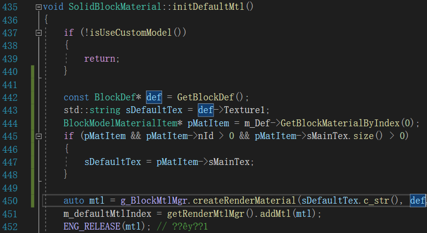

BasicBlockMaterial类重载了initDefaultMtl方法, 需要处理:
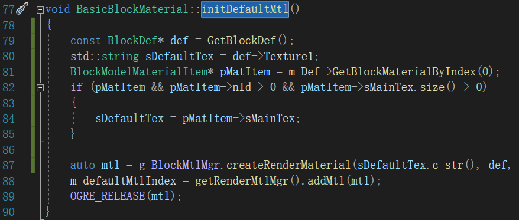

##### 3.树叶
218
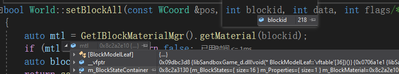
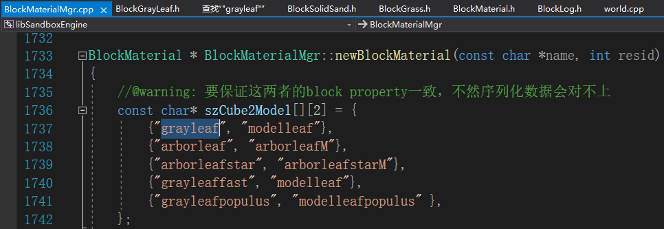

1.方块使用包内材质表的贴图流程已经通了; 明早要首先确认下自定义图片的使用流程, 保内贴图能否满足
2.殷桃木是两个子模型, 随便换一个模型的话显示应该会有问题
3.乌金矿是两部分组成, 立方体加突出的obj模型, 可以做成换两部分贴图, 现在是这么做的, 可以看下效果

#### 4.生物创建
##### 1.运行模式
没有应用模型组件?ClientMob::Instantiate:
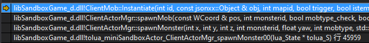

##### 2.编辑模式
二者颜色不同
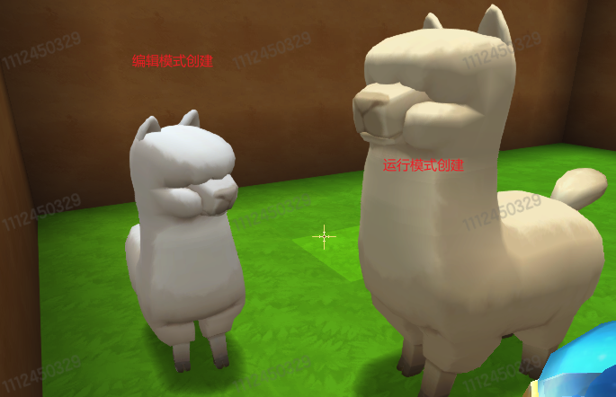
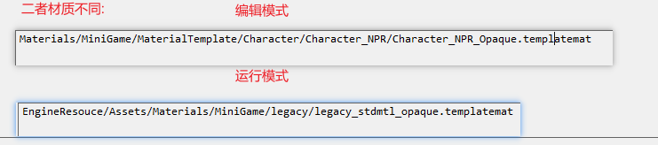

#### 5.Avatar
    ModelRenderer::AddAvatar()
    
