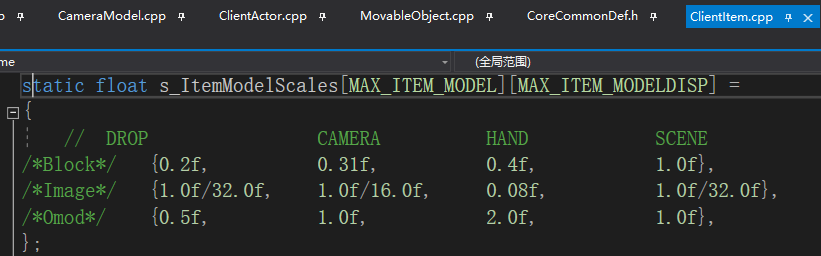
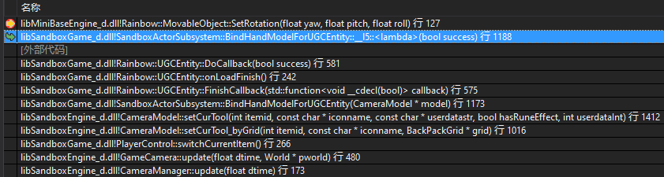

#### 1.手持模型scale参数

##### 1.方块、道具的问题
CameraModel::setCurTool-->

SandboxActorSubsystem::UpdateFPSLocalTransform-->

s_ItemModelScales-->

旋转也有一些代码里面写死的:

微缩模型scale问题:
ClientItem::createItemModel
这里是设置Model的scale:

而且这里还是异步的:

下面是设置Entity的scale, 二者是叠加关系:
ItemComponent::UpdateItemLocalTransform-->

如果有模型变得很小的情况, 可能是这里没处理对, 不要算重复了

##### 2.抢的问题
旋转的特殊处理
SandboxActorSubsystem::BindHandModelForUGCEntity(CameraModel* model)

新枪械设置第一人称手持模型旋转不生效, 异步加载的问题, 设置的值被覆盖了:
CameraModel::setCurTool-->
新枪械来这里:

先设置的道具组件的参数:
ItemComponent::UpdateItemLocalTransform

后来在回调中又重置成默认值了:
SandboxActorSubsystem::BindHandModelForUGCEntity(CameraModel* model)

